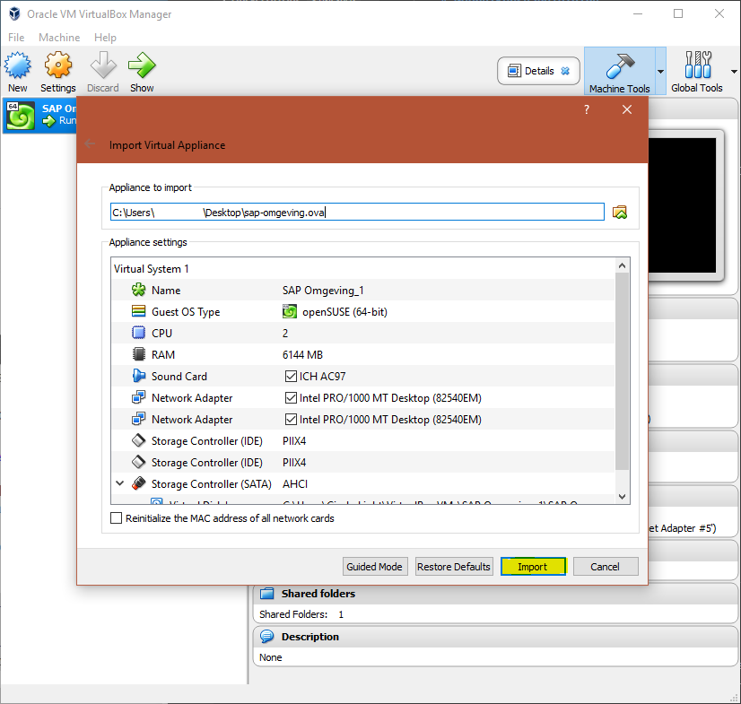
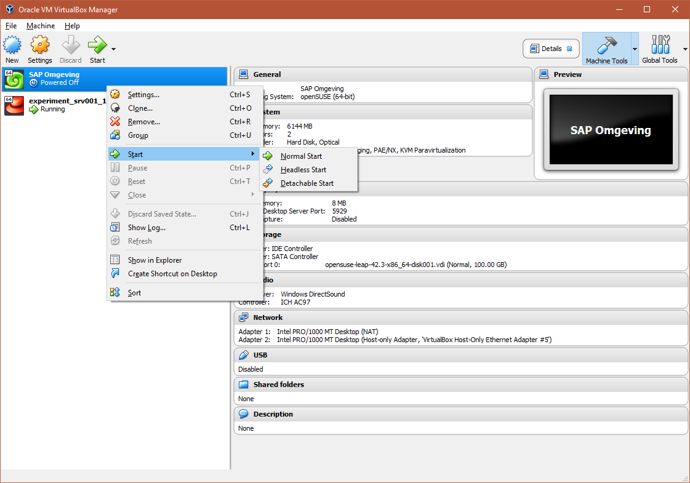
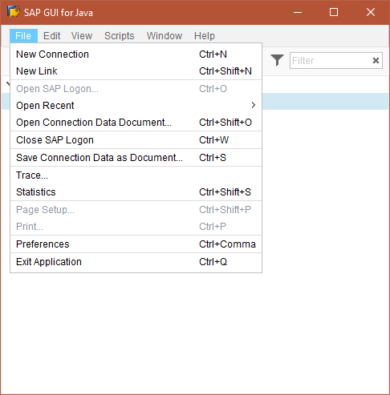
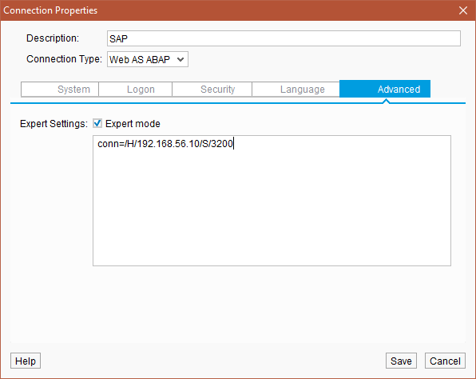
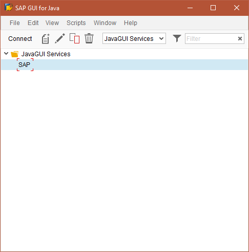
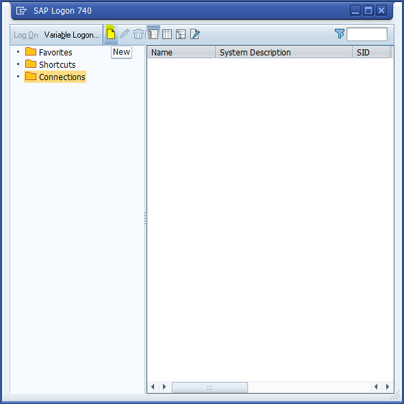
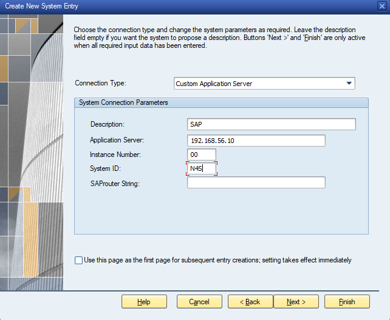
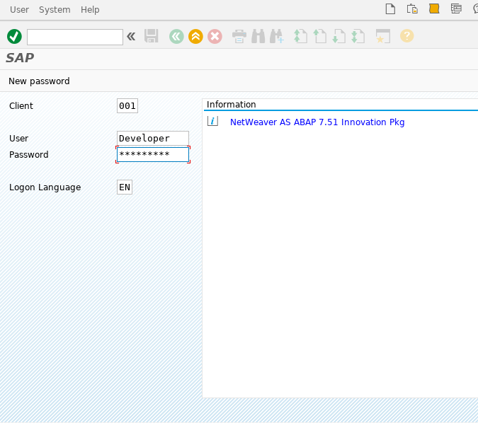
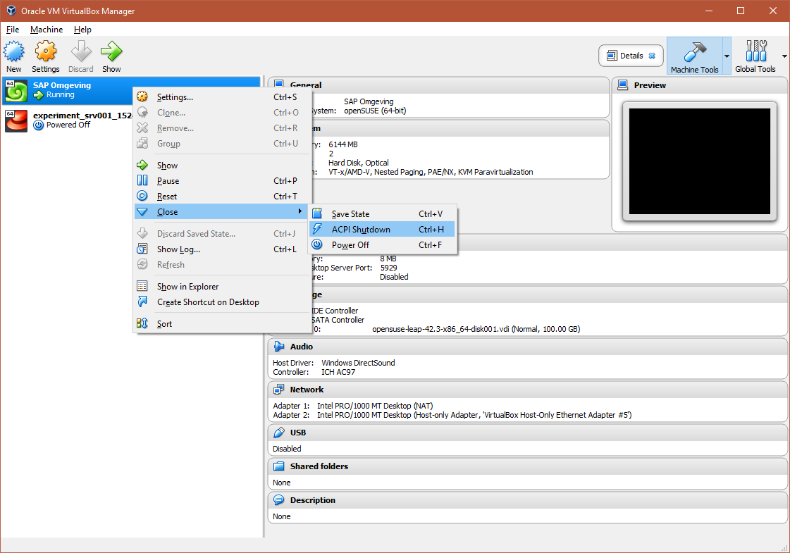

# Gebruikershandleiding SAP-omgeving

Vereisten:

* SAP GUI for Java / SAP Gui for Windows
* Virtualbox versie: v5.2.8 of later
* sap-omgeving.ova bestand

## Installatie

1. Dubbelklik op de sap-omgeving.ova file. Dit opent automatisch virtualbox.
1. Klik op `Import` om de virtuele machine te importeren.

1. Wacht tot de virtuele machine geïmporteerd is.
1. Start de machine met de `Headless start` optie. Wacht een tweetal minuten alvorens te connecteren, zodat de server volledig kan opstarten.

## Connecteren met SAP GUI for Java

1. Open de SAP GUI for Java.
1. Klik op `New Connection` onder het menu `File`.

1. Vul de vereiste velden in volgens onderstaande foto.

1. Druk vervolgens op `Save` en je server wordt toegevoegd aan de lijst in de SAP-client.
1. Ten slotte selecteer je de server en maak je verbinding door op `Connect` te drukken.

## Connecteren met SAP GUI for Windows

1. Open de SAP GUI for Windows.
1. Klik op `New` voor een nieuwe connectie te maken.

1. Op het volgende venster klik je op `Next`.
1. Vul de vereiste velden in volgens onderstaande foto.

1. Druk vervolgens nog twee maal op `Next` en nog een keer op `Finish`.
1. Ten slotte maak je verbinding met de server door te dubbelklikken op `SAP`.

## Inloggen op de SAP-omgeving
1. De standaard inloggegevens zijn als volgt:
   User:     `Developer`
   Password: `Appl1ance`
1. Voer deze gegevens in op de inlogpagina en druk op enter, of druk op het groene vinkje links bovenaan.

## Server afsluiten

1. Sluit de SAP-client.
1. Sluit nu de server af. Hiervoor druk je op `ACPI Shutdown`.

